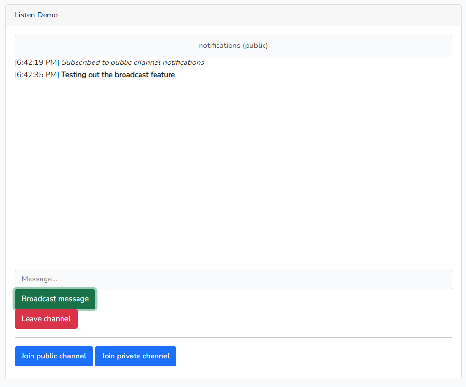
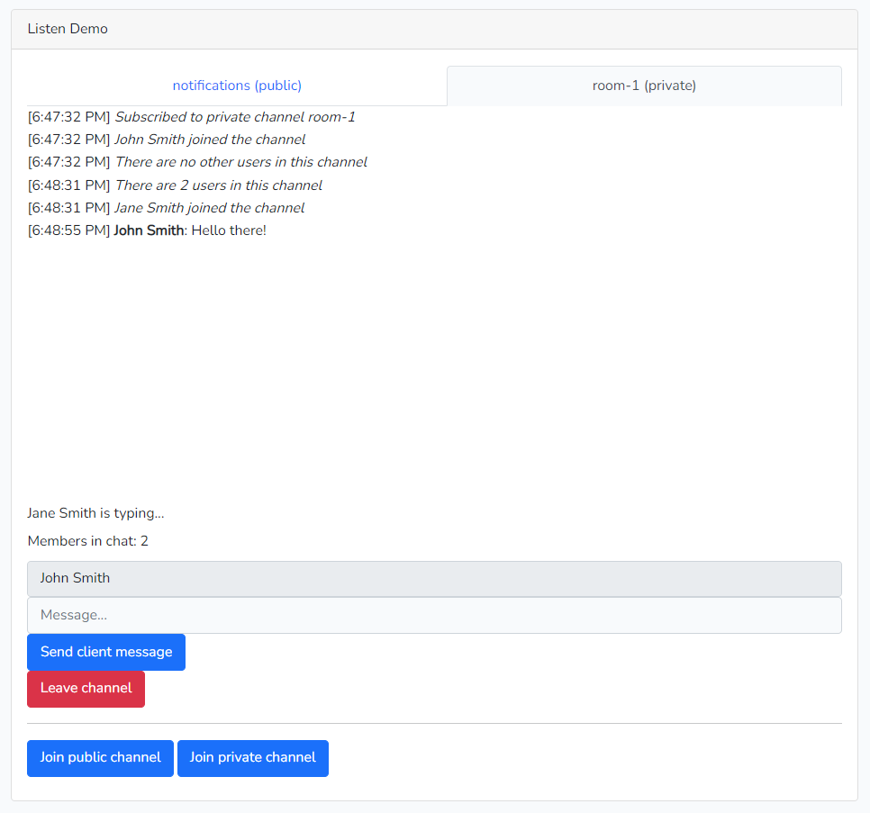
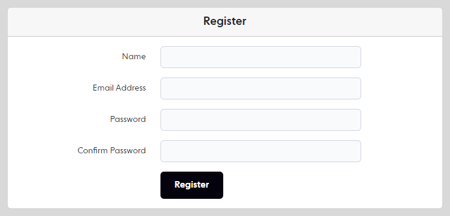

# Chat app using Ably Broadcaster+Echo

Demo web-chat app using Ably Broadcaster+Echo based on laravel.

## Features
* Public chat rooms for a guest user.
* Laravel built-in user authentication (registration + login).
* Private chat rooms with presence for authenticated users.
* Typing indicator for private rooms.
* Join multiple rooms simultaneously.

## Requirements
1. PHP version >= 7.3.
2. Node.js >= 14.x.x.

## Setup
> Note - To quickly run the app without installing dependencies explicitly, check [Run Using Docker](#run-using-docker).

1. Clone the repository.
```
  git clone https://github.com/ably-labs/laravel-broadcast-app
```
2. Create the `.env` file in the project root. Copy contents from `.env.example` into `.env`.
3. Set [ABLY_KEY](https://faqs.ably.com/setting-up-and-managing-api-keys) in .env file .
```
  ABLY_KEY=ROOT_API_KEY_COPIED_FROM_ABLY_WEB_DASHBOARD
```
4. Install dependencies.
```
  composer install
  npm install
```
5. Generate application encryption key.
```
  php artisan key:generate
```
6. Create simple sqlite db file.
```
  touch database/database.sqlite // On linux
  New-Item database\\database.sqlite -type file // On windows poweshell
```
7. Run all of db migrations.
```
  php artisan migrate
```
8. Start laravel backend server.
```
  php artisan serve 
```
9. Start UI server in watch/hot-reloading mode.
```
  npm run watch
```
10. Access the web app via http://127.0.0.1:8000.

## Run Using Docker

1. Clone the repo. and set [ABLY_KEY](https://faqs.ably.com/setting-up-and-managing-api-keys) as mentioned in step 2 and 3 of [SETUP](#setup).
2. Start the app/docker-services using following command.
```
   docker-compose up
```
3. Access the web app via http://127.0.0.1:8000.
4. To stop the app/docker-services, run following command in a new terminal.
```
   docker-compose down
```

## Usage
The web app works in two modes -

**1. Guest Mode ( Only public rooms can be created / joined)**
- Use room name in any format.
- In public rooms, messages are published via laravel server to ably (client can't publish messages directly through echo).

**2. User Mode ( Private rooms can be created / joined)**
- If user signed up and logged in into the Laravel app, it can create/join a private room.
- The required room prefix is `room-<id>`, as defined in `routes/rooms.php`.
- In private rooms, messages are published through Laravel Echo from client-side. 

## Screenshots

**Public room**



**Private room**



**User registration**


